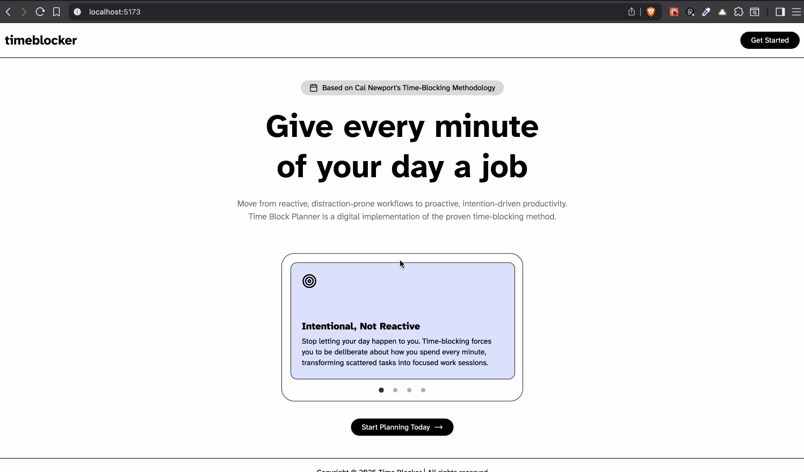
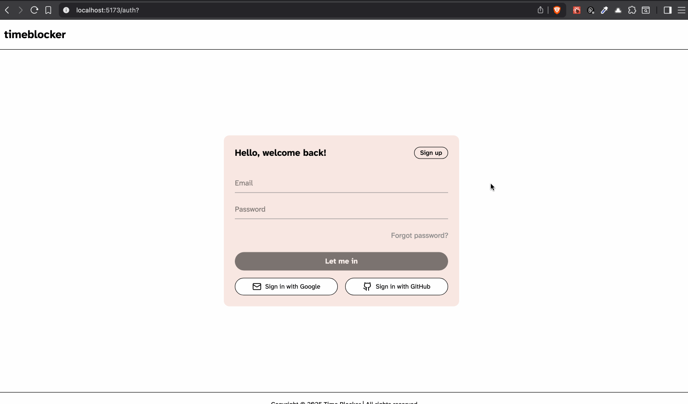
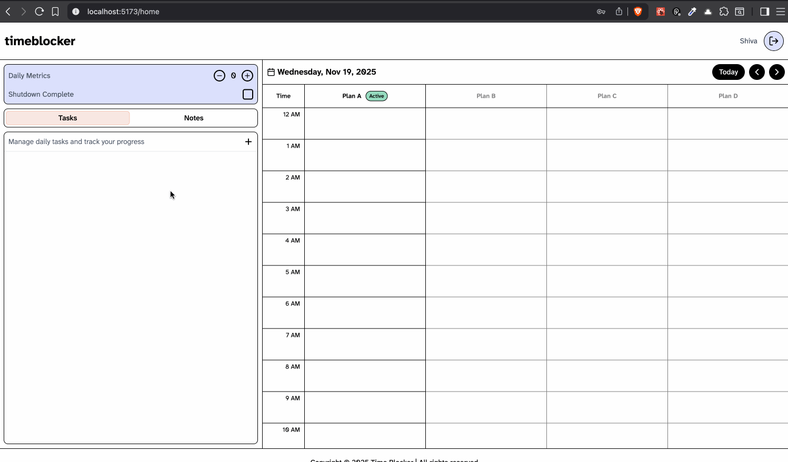
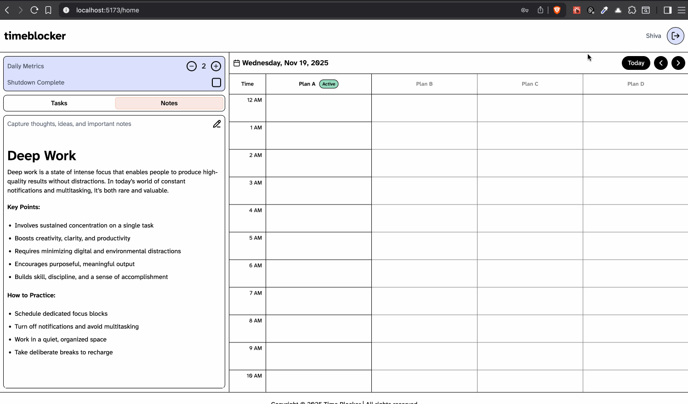

# Time Blocker

CodePath WEB103 Final Project

Designed and developed by: **Veerendranath, Pranava Sree, Mohamed Aweys Abucar**

🔗 Link to deployed app: https://timeblocker-client.onrender.com/

## About

### Description

Time Blocker is a minimalist web application that digitizes author Cal Newport's proven time-blocking methodology. The core of the application is a clean, intuitive interface that helps you move from a reactive, distraction-filled day to a proactive and intentional one.

It features a unique two-panel layout:

- **The Collection Page**: A dedicated space on the left to quickly capture tasks, notes, and daily metrics, just like the collection page in a physical planner.

- **The Time Block Grid**: A visual, vertical timeline on the right where you can design your day. Simply drag tasks from your collection page and drop them onto the grid to assign them a specific time.

The application is built for the reality that plans change. When interruptions occur, you can easily adapt your schedule by dragging, dropping, and resizing time blocks, providing the flexibility of a digital tool with the focused clarity of pen and paper.

### Purpose

The primary purpose of this application is to solve the problem of "productivity app burnout" and the reactive nature of modern knowledge work. Many digital tools, in an attempt to be all-in-one solutions, become overly complex and a source of distraction themselves. Users often spend more time organizing their productivity app than doing the actual work.

This project provides an opinionated and simple alternative. Instead of offering endless features, it provides a proven framework for focus, helping users to:

- **Give Every Minute a Job**: Intentionally plan the day to balance important "deep work" with urgent shallow tasks.

- **Separate Capture from Planning**: By physically separating the task list from the schedule, the app reduces the cognitive load of a long to-do list and prevents the constant temptation to clutter the calendar.

- **Adapt with Ease**: The purpose of the app's drag-and-drop interface is to digitally replicate this fluid, realistic planning process.

- **Enable Clear Shutdowns**: The "Shutdown Complete" checkbox, taken directly from the planner template, is a key feature designed to help users consciously end their workday, reduce work-related anxiety, and prevent burnout.

### Inspiration

This project is directly inspired by Cal Newport's physical Time-Block Planner and his underlying philosophy of time management, which he has advocated for over fifteen years.

The core idea is to create the definitive digital version of Newport's system, which emphasizes replacing stressful busyness with empowering intention. The application is built for users who want to practice "Deep Work" and apply principles of digital minimalism to their daily planning.

## Tech Stack

#### Frontend

- React
- Tailwind CSS - _for styling_
- React Router - _for routing_
- React Query - _for data fetching_
- Zustand - _for state management_

#### Backend

- Node.js
- Express
- TypeScript
- Zod - _for validation_

#### Databases

- PostgreSQL
- Drizzle ORM

## Features

- ✅ A Landing Page with Log in and Sign Up Features

  

- ✅ User Management

  

- The Home Page

  - The Collection Page (Left Panel - For Capture)

    

  - The Time Block Grid (Right Panel -- For Planning)

    

- Advanced & Post-MVP Features

## Installation Instructions

### Prerequisites

Before you begin, ensure you have the following installed on your system:

- **Node.js** (v18 or higher) - [Download](https://nodejs.org/)
- **npm** or **yarn** - Comes with Node.js
- **PostgreSQL** (v12 or higher) - [Download](https://www.postgresql.org/download/)
- **Git** - [Download](https://git-scm.com/)

### Database Setup

1. **Create a PostgreSQL database:**

   ```bash
   # Connect to PostgreSQL
   psql -U postgres

   # Create database
   CREATE DATABASE timeblocker;

   # Exit PostgreSQL
   \q
   ```

2. **Note your database credentials** (you'll need these for environment variables):
   - Database name: `timeblocker`
   - Database user: (usually `postgres` or your PostgreSQL username)
   - Database password: (your PostgreSQL password)
   - Database host: (usually `localhost`)
   - Database port: (usually `5432`)

### Backend Setup

1. **Navigate to the server directory:**

   ```bash
   cd server
   ```

2. **Install dependencies:**

   ```bash
   npm install
   ```

3. **Create a `.env` file in the `server` directory:**

   ```bash
   touch .env
   ```

4. **Add the following environment variables to `server/.env`:**

   ```env
   # Server Configuration
   PORT=3000
   NODE_ENV=development

   # JWT Configuration
   JWT_SECRET=your-super-secret-jwt-key-change-in-production
   JWT_EXPIRES_IN=7d

   # Database Configuration (use either format)
   # Option 1: Using DB_* prefix
   DB_HOST=localhost
   DB_PORT=5432
   DB_USER=postgres
   DB_PASSWORD=your-database-password
   DB_NAME=timeblocker

   # Option 2: Using PostgreSQL standard variables
   # PGHOST=localhost
   # PGPORT=5432
   # PGUSER=postgres
   # PGPASSWORD=your-database-password
   # PGDATABASE=timeblocker

   # OAuth - Google (Optional, for Google Sign-In)
   GOOGLE_CLIENT_ID=your-google-client-id
   GOOGLE_CLIENT_SECRET=your-google-client-secret
   GOOGLE_CALLBACK_URL=http://localhost:3000/api/auth/google/callback

   # OAuth - GitHub (Optional, for GitHub Sign-In)
   GITHUB_CLIENT_ID=your-github-client-id
   GITHUB_CLIENT_SECRET=your-github-client-secret
   GITHUB_CALLBACK_URL=http://localhost:3000/api/auth/github/callback

   # Frontend URL (for CORS)
   FRONTEND_URL=http://localhost:5173
   ```

5. **Build the TypeScript code:**

   ```bash
   npm run build
   ```

6. **Set up the database schema:**

   ```bash
   # Generate migration files (if schema changes)
   npm run db:generate

   # Apply migrations to database
   npm run db:migrate
   ```

   **Note:** If you encounter conflicts with existing tables, you may need to use `npm run db:push` instead, but `db:migrate` is recommended for production.

### Frontend Setup

1. **Navigate to the client directory:**

   ```bash
   cd client
   ```

2. **Install dependencies:**

   ```bash
   npm install
   # or
   yarn install
   ```

3. **The frontend is configured to proxy API requests to `http://localhost:3000` during development** (configured in `vite.config.js`). No additional environment variables are needed for local development.

## Running the Application

### Development Mode

1. **Start the backend server:**

   ```bash
   cd server
   npm run dev
   ```

   The server will start on `http://localhost:3000` and automatically restart when you make changes.

2. **Start the frontend development server** (in a new terminal):

   ```bash
   cd client
   npm run dev
   ```

   The frontend will start on `http://localhost:5173` (or the next available port).

3. **Open your browser and navigate to:**

   ```
   http://localhost:5173
   ```

### Production Mode

1. **Build the backend:**

   ```bash
   cd server
   npm run build
   ```

2. **Start the backend server:**

   ```bash
   npm start
   ```

3. **Build the frontend:**

   ```bash
   cd client
   npm run build
   ```

4. **Preview the production build:**

   ```bash
   npm run preview
   ```

   **Note:** For production deployment, you'll typically serve the built frontend files (`client/dist`) through a web server like Nginx or serve them from your backend server.

### Database Management Commands

The following commands are available in the `server` directory:

- `npm run db:generate` - Generate migration files from schema changes
- `npm run db:migrate` - Apply migrations to the database
- `npm run db:push` - Push schema changes directly to database (development only)
- `npm run db:studio` - Open Drizzle Studio (database GUI) to view and edit data

### Troubleshooting

**Database Connection Issues:**

- Ensure PostgreSQL is running: `pg_isready` or `psql -U postgres`
- Verify your database credentials in the `.env` file
- Check that the database exists: `psql -U postgres -l`

**Port Already in Use:**

- Backend: Change `PORT` in `server/.env`
- Frontend: Vite will automatically use the next available port

**TypeScript Compilation Errors:**

- Run `npm run build` in the `server` directory to see detailed error messages
- Ensure all dependencies are installed: `npm install`

**CORS Issues:**

- Verify `FRONTEND_URL` in `server/.env` matches your frontend URL
- Check that the frontend proxy is configured correctly in `client/vite.config.js`
